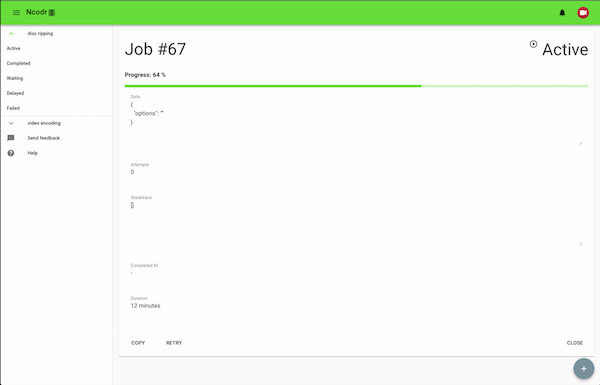

# ncodr-ui
> Front-End Web UI for ncodr[https://github.com/aztechian/ncodr]

[![Greenkeeper Status][greenkeeper-image]][greenkeeper-url]
[![Build Status][travis-image]][travis-url]

One to two paragraph statement about your product and what it does.



## Installation

OS X & Linux:

```sh
npm install ncodr-ui --save
```

## Usage example

Ncodr-UI can be used without modification from the NPM module. The `/dist` directory holds the latest pre-compiled release of the code. If you are simply looking to use Ncodr-UI, just serve up the contents of `/dist` in your favorite HTTP server.

To use this with a Node Express app, use something like:
```javascript
  app.use(Express.static('node_modules/ncodr-ui/dist'));
```

Because Ncodr-UI is a Single Page App (SPA), it's useful to have something like the following line at the end of your middleware stack (if using Express):
```javascript
  app.use('*', Express.static('node_modules/ncodr-ui/dist/index.html'));
```
This makes sure that if the server can't otherwise find the requested page/resource then the index page will be served up, and the client-side router in Vue will take care of getting the correct content for that route.

Additionally, if you want to set the client configuration, you will need your server to serve up a javascript file at `/config.js`. A simple example would be:
```javascript
  app.use('/config.js', Express.static('path/to/custom/config.js'));
```
This allows configuration of Ncodr-UI for the specifics of your deployment. At the moment, this relates to authentication being required, and what OAuth client ID to use.

## Development setup

Describe how to install all development dependencies and how to run an automated test-suite of some kind. Potentially do this for multiple platforms.

```sh
# install dependencies
npm install

# serve with hot reload at localhost:8080
npm run serve

# build for production with minification
npm run build

# build for production and view the bundle analyzer report
npm run build --report

# run unit tests
npm run test

# run e2e tests
npm run e2e

```

For a detailed explanation on how things work, check out the [guide](http://vuejs-templates.github.io/webpack/) and [docs for vue-loader](http://vuejs.github.io/vue-loader).


## Release History

* 0.0.0
    * TODO

## Meta

Ian Martin – [@aztechian](https://github.com/aztechian) – ian@imartin.net

Distributed under the MIT license. See ``LICENSE`` for more information.

[https://github.com/aztechian/ncodr-ui](https://github.com/aztechian/ncodr-ui)

## Contributing

1. [Fork it](https://github.com/aztechian/ncodr-ui/fork)
2. Create your feature branch (`git checkout -b feature/fooBar`)
3. Commit your changes (`git commit -am 'Add some fooBar'`)
4. Push to the branch (`git push origin feature/fooBar`)
5. Create a new Pull Request

<!-- Markdown link & img dfn's -->
[travis-image]: https://img.shields.io/travis/aztechian/ncodr-ui/master.svg?style=flat-square
[travis-url]: https://travis-ci.org/aztechian/ncodr-ui
[wiki]: https://github.com/aztechian/ncodr-ui/wiki
[greenkeeper-image]: https://badges.greenkeeper.io/aztechian/ncodr-ui.svg
[greenkeeper-url]: https://greenkeeper.io/
